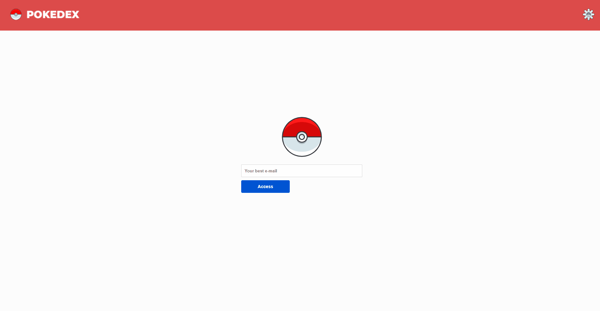

<h1 align="center">🚀 Pokedex</h1>


<div align="center">
<table border="0" >
       <p>
        
       </p>
 </table>
</div>

<br />
  <a href="https://pokedex.mycatdoitbetter.vercel.app/">
  <strong>
  <p align="center" style="text-align: center;">
  Access the Pokedex hosted in Vercel here! 🎉
  </p>
</strong>
</a>

<br />
<br />

  <p align="center" style="text-align: center; font-size: 25px">
  ✨  How looks like ✨
  </p>

<p align="center" style="text-align: center;">
        
</p>

<br />
<h1></h1>
<br />
<h2>
Hey, have a look too! 👀  <br/>This application is using the <a href="https://pokeapi.co/">Poke API</a>
through the <a href="https://github.com/mazipan/graphql-pokeapi">GraphQL for PokeApi</a>
</h2>

<br />

<h1></h1>
<br />


You can init this application to! clone the projetct and you can start by:

```bash
cd pokedex
yarn dev
```


Also, try to find the #152 Pokémon. ;)
